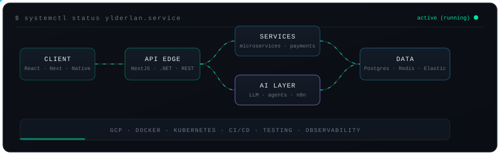

<div align="center">



<br/>

[](https://www.linkedin.com/in/franciscoylderlanoliveira/)
[](#)
[](#)
[](#)
[](https://github.com/FranciscoYlderlan?tab=followers)


</div>

## `$ whoami`

```bash
> cat ~/profile.json
```

```jsonc
{
  "name":     "Francisco Ylderlan Chaves de Oliveira",
  "role":     "Software Engineer · Full-Stack",
  "company":  "TM Mentoring",
  "since":    2018,
  "education":"UFMA — Universidade Federal do Maranhão",
  "based_in": "São Paulo, BR",
  "mode":     ["remote", "hybrid", "on-site"],
  "i_build":  ["scalable web apps", "internal platforms",
               "data & ETL pipelines", "multi-agent AI systems"],
  "status":   "open to opportunities"
}
```

I design and ship software end to end — frontend, backend, cloud and the automation layer in between.
Most of my work starts the same way: a manual, expensive process that shouldn't exist anymore.
I replace it with something reliable, measurable and maintainable.

<div align="center"></div>

## `$ systemctl status ylderlan.service`

<div align="center">
  
</div>

<div align="center"></div>

## `$ cat ./stack.json`

<table>
  <tr>
    <td><b><code>core</code></b></td>
    <td></td>
  </tr>
  <tr>
    <td><b><code>frontend</code></b></td>
    <td></td>
  </tr>
  <tr>
    <td><b><code>backend</code></b></td>
    <td></td>
  </tr>
  <tr>
    <td><b><code>data</code></b></td>
    <td></td>
  </tr>
  <tr>
    <td><b><code>platform</code></b></td>
    <td></td>
  </tr>
  <tr>
    <td><b><code>quality</code></b></td>
    <td></td>
  </tr>
</table>

> `AI layer` — LLM integration · multi-agent orchestration · n8n · Claude Code · RAG & prompt pipelines

<div align="center"></div>

## `$ git log --format=impact`

<div align="center">
  
</div>

<details>
<summary><code>› expand the trace</code></summary>

<br/>

**Software Engineer · TM Mentoring** — *Feb 2025 → present · Remote*
Refactored and modernized legacy job-search scripts, lifting mentee job acquisition by **900%**. Built the internal platform that replaced the team's paid third-party tooling, and automated invoice (NF), DAS and DARF issuance end to end.
`React` `C# / .NET` `PostgreSQL` `Firestore` `Elasticsearch` `Redis` `GCP` `Docker` `Kubernetes` `LLM & multi-agent systems`

**Software Engineer · Lab Yes! (Colab)** — *May 2023 → Feb 2025 · Remote*
Designed the foundational architecture for a volunteer-recruitment platform, then introduced structured Discovery/Delivery with explicit DoR and DoD — turning delivery predictability into a process, not a hope.
`Next.js` `NestJS` `Node` `TypeScript` `PostgreSQL` `OAuth / JWT` `Vitest`

**Freelance Software Engineer · Public Health Dept. (MA)** — *Oct 2023 → Sep 2024*
Automated the preparation and release of research datasets, removing **6+ hours of manual work per day**, and set the project-wide standards for architecture, documentation and logging.
`React` `Node` `Python` `PostgreSQL` `ETL` `Docker` `Storybook`

**Research & Development Engineer · NCA-UFMA / Equatorial Energia** — *Oct 2018 → Apr 2022*
Cut Big Data preprocessing from **4 hours to 20 minutes**, and built ETL systems for analysis, cataloging, governance and security.
`C#` `Python` `Oracle` `Big Data` `ETL` `Machine Learning` `Linux`

</details>

<div align="center"></div>

## `$ ls -la ~/projects`

<table>
  <tr>
    <td width="50%" valign="top">

### [`Backend-Starter-Kit`](https://github.com/FranciscoYlderlan/Backend-Starter-Kit)
Opinionated backend foundation built on **NestJS + Prisma**, wired around dependency inversion so the domain never knows who's calling.

  

</td>
    <td width="50%" valign="top">

### [`Frontend-Starter-Kit`](https://github.com/FranciscoYlderlan/Frontend-Starter-Kit)
Production-ready **Next.js** template: Shadcn UI, Tailwind and React-Hook-Form already talking to each other.

  

</td>
  </tr>
  <tr>
    <td width="50%" valign="top">

### [`AI Video Description Composer`](https://github.com/FranciscoYlderlan/Automated-Video-Description-Composer-API)
**OpenAI-powered** service that turns a transcript into titles and descriptions — [API](https://github.com/FranciscoYlderlan/Automated-Video-Description-Composer-API) + [web client](https://github.com/FranciscoYlderlan/Automated-Video-Description-Composer-WEB).

  

</td>
    <td width="50%" valign="top">

### [`Shopper Price Update Tool`](https://github.com/FranciscoYlderlan/Shopper-Price-Update-Tool)
CSV-driven bulk price updater with a validation layer that refuses bad data before it reaches the catalog.

  

</td>
  </tr>
</table>

<div align="center"></div>

## `$ gh stats --live`

<div align="center">



<br/>


<sub>Generated in-repo by <a href="./scripts/gh-stats.mjs"><code>scripts/gh-stats.mjs</code></a> and refreshed daily by GitHub Actions - no third-party widget to go down.</sub>

</div>

<div align="center"></div>

## `$ ./connect --with francisco-ylderlan`

<div align="center">


<br/>

[](https://www.linkedin.com/in/franciscoylderlanoliveira/)
[](https://github.com/FranciscoYlderlan)

<sub><code>exit 0</code> — thanks for reading the logs.</sub>

</div>
